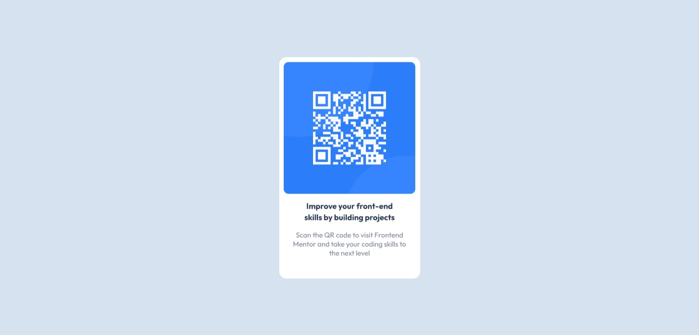

# Frontend Mentor - QR Code Component


This is a solution to the [QR Code Component Challenge on Frontend Mentor](https://www.frontendmentor.io/challenges/qr-code-component-iux_sIO_H). Frontend Mentor challenges help you improve your coding skills by building realistic projects.

## Table of contents

-   [Overview](#overview)
    -   [Screenshots](#screenshot)
    -   [Links](#links)
-   [My process](#my-process)
    -   [Built with](#built-with)
    -   [What I learned](#what-i-learned)
-   [Author](#author)

## Overview

### Screenshots




### Links

-   Solution URL: [Frontend Mentor](https://www.frontendmentor.io/solutions/qr-code-component-WryzdF26Sa/)
-   Live Site URL: [Github Pages](https://philopaterhany.github.io/QR-Code-Component/)

## My process

### Built with

-   Semantic HTML5 Markup
-   CSS Custom Properties
-   Flexbox

### What I learned

```html
<main class="container">
    <div class="image">
        
    </div>
    <div class="text">
        <h1>Improve your front-end skills by building projects</h1>
        <p>
            Scan the QR code to visit Frontend Mentor and take your coding
            skills to the next level
        </p>
    </div>
</main>
```

```css
body {
    display: flex;
    justify-content: center;
    align-items: center;
    height: 100vh;
}
.container .image {
    padding: 10px;
}
.container .text {
    padding: 0 20px;
}
.container .text h1 {
    padding: 0 18px;
}
.container .text p {
    padding: 15px 8px 0;
}
```

## Author

-   Website - Portfolio Is Coming Out Soon!
-   Frontend Mentor - [@PhilopaterHany](https://www.frontendmentor.io/profile/PhilopaterHany/)
-   Twitter - [@PhilopaterHany4](https://www.twitter.com/PhilopaterHany4/)
-   Facebook - [Philopater Hany](https://www.facebook.com/philopater.hany.3)
-   Discord - [#8178](https://discord.com/#8178/)
